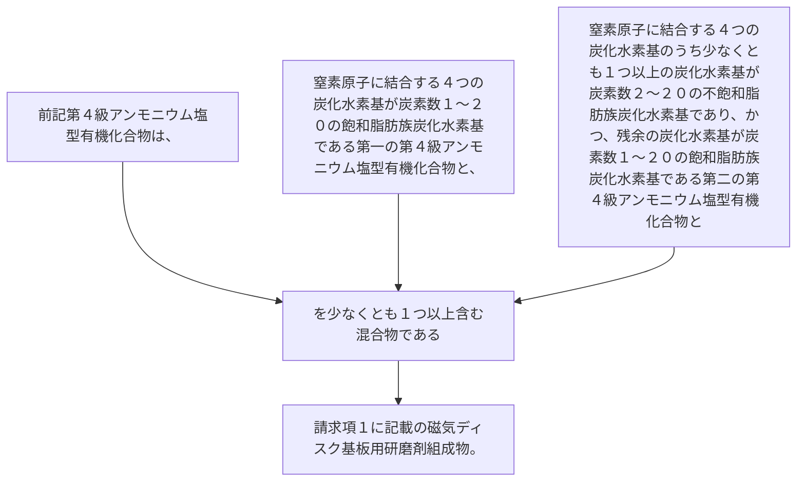

```mermaid
flowchart TD
A[前記第４級アンモニウム塩型有機化合物は、]
B[窒素原子に結合する４つの炭化水素基が炭素数１～２０の飽和脂肪族炭化水素基である第一の第４級アンモニウム塩型有機化合物と、]
C[窒素原子に結合する４つの炭化水素基のうち少なくとも１つ以上の炭化水素基が炭素数２～２０の不飽和脂肪族炭化水素基であり、かつ、残余の炭化水素基が炭素数１～２０の飽和脂肪族炭化水素基である第二の第４級アンモニウム塩型有機化合物と]
D[を少なくとも１つ以上含む混合物である]
E[請求項１に記載の磁気ディスク基板用研磨剤組成物。]
A --> D
B --> D
C --> D
D --> E
```