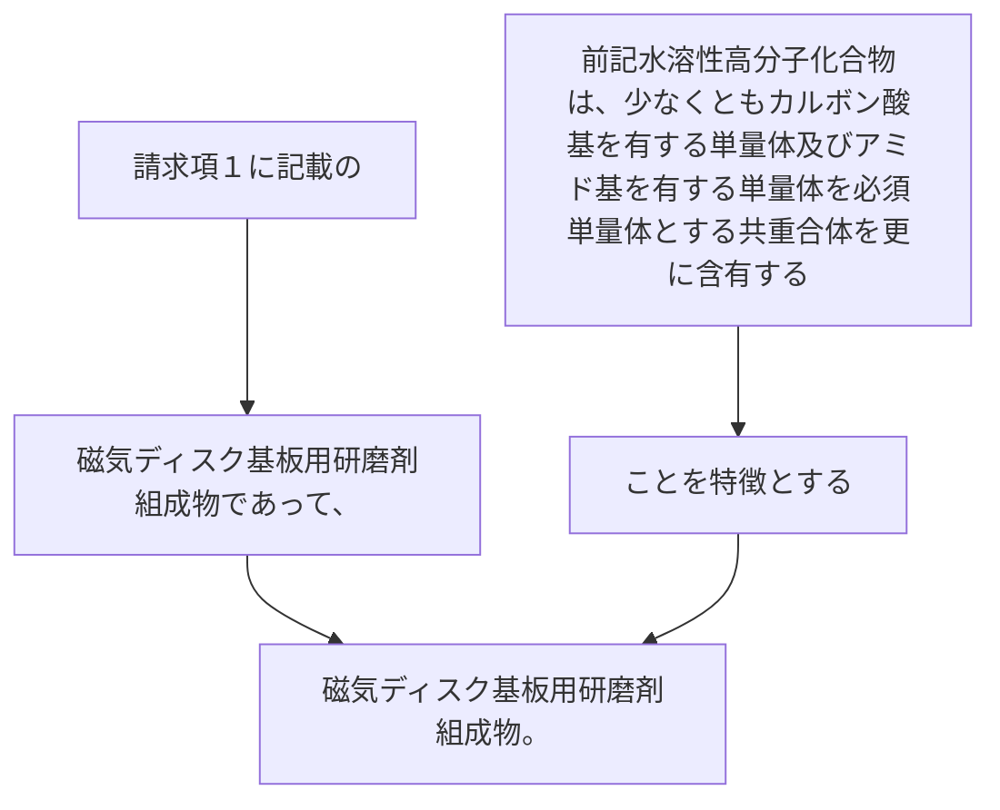

前記水溶性高分子化合物は、少なくともカルボン酸基を有する単量体及びアミド基を有する単量体を必須単量体とする共重合体を更に含有する請求項１に記載の磁気ディスク基板用研磨剤組成物。

```mermaid
flowchart TD
A[請求項１に記載の]
B[磁気ディスク基板用研磨剤組成物であって、]
C[前記水溶性高分子化合物は、少なくともカルボン酸基を有する単量体及びアミド基を有する単量体を必須単量体とする共重合体を更に含有する]
D[ことを特徴とする]
E[磁気ディスク基板用研磨剤組成物。]
A --> B
B --> E
C --> D
D --> E
```