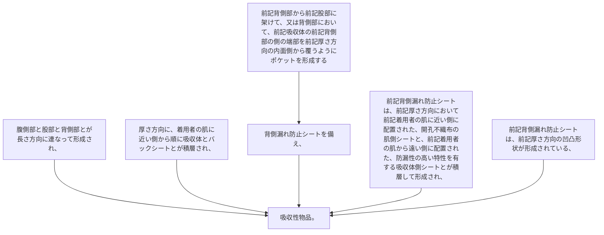

腹側部と股部と背側部とが長さ方向に連なって形成され、厚さ方向に、着用者の肌に近い側から順に吸収体とバックシートとが積層され、前記背側部から前記股部に架けて、又は背側部において、前記吸収体の前記背側部の側の端部を前記厚さ方向の内面側から覆うようにポケットを形成する背側漏れ防止シートを備え、
前記背側漏れ防止シートは、前記厚さ方向において前記着用者の肌に近い側に配置された、開孔不織布の肌側シートと、前記着用者の肌から遠い側に配置された、防漏性の高い特性を有する吸収体側シートとが積層して形成され、
前記背側漏れ防止シートは、前記厚さ方向の凹凸形状が形成されている、吸収性物品。
