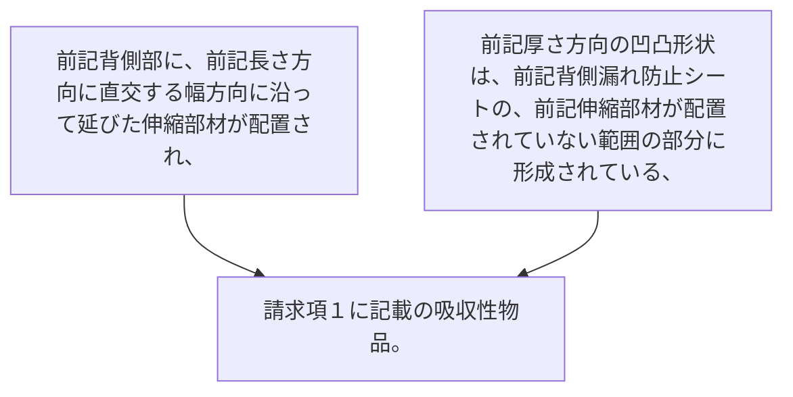

前記背側部に、前記長さ方向に直交する幅方向に沿って延びた伸縮部材が配置され、
前記厚さ方向の凹凸形状は、前記背側漏れ防止シートの、前記伸縮部材が配置されていない範囲の部分に形成されている、請求項１に記載の吸収性物品。

```mermaid
flowchart TD
A[前記背側部に、前記長さ方向に直交する幅方向に沿って延びた伸縮部材が配置され、]
B[前記厚さ方向の凹凸形状は、前記背側漏れ防止シートの、前記伸縮部材が配置されていない範囲の部分に形成されている、]
C[請求項１に記載の吸収性物品。]
A --> C
B --> C
```