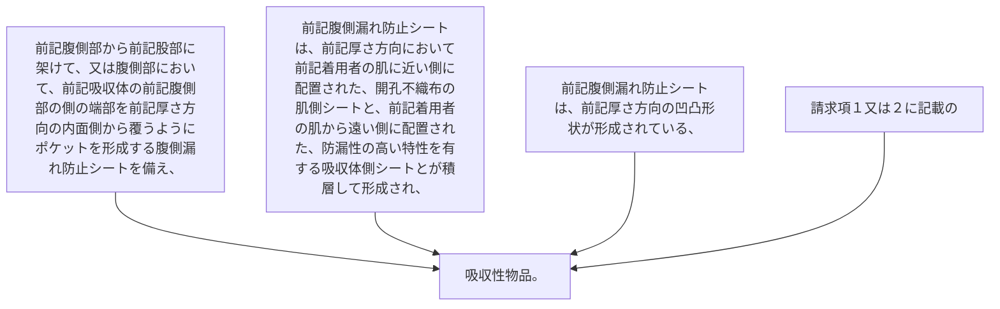

```mermaid
flowchart TD
A[前記腹側部から前記股部に架けて、又は腹側部において、前記吸収体の前記腹側部の側の端部を前記厚さ方向の内面側から覆うようにポケットを形成する腹側漏れ防止シートを備え、]
B[前記腹側漏れ防止シートは、前記厚さ方向において前記着用者の肌に近い側に配置された、開孔不織布の肌側シートと、前記着用者の肌から遠い側に配置された、防漏性の高い特性を有する吸収体側シートとが積層して形成され、]
C[前記腹側漏れ防止シートは、前記厚さ方向の凹凸形状が形成されている、]
D[請求項１又は２に記載の]
E[吸収性物品。]

A --> E
B --> E
C --> E
D --> E
```