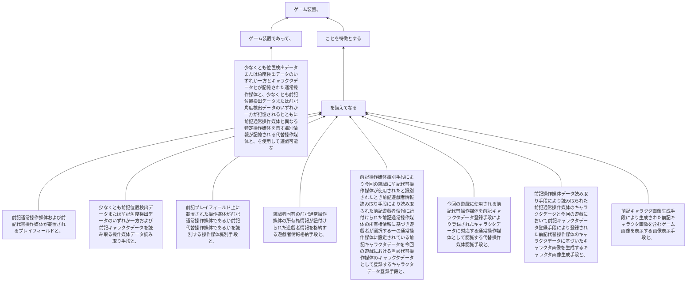

少なくとも位置検出データまたは角度検出データのいずれか一方とキャラクタデータとが記憶された通常操作媒体と、少なくとも前記位置検出データまたは前記角度検出データのいずれか一方が記憶されるとともに前記通常操作媒体と異なる特定操作媒体を示す識別情報が記憶される代替操作媒体と、を使用して遊戯可能なゲーム装置であって、
前記通常操作媒体および前記代替操作媒体が載置されるプレイフィールドと、
少なくとも前記位置検出データまたは前記角度検出データのいずれか一方および前記キャラクタデータを読み取る操作媒体データ読み取り手段と、
前記プレイフィールド上に載置された操作媒体が前記通常操作媒体であるか前記代替操作媒体であるかを識別する操作媒体識別手段と、
遊戯者固有の前記通常操作媒体の所有権情報が紐付けられた遊戯者情報を格納する遊戯者情報格納手段と、
前記操作媒体識別手段により今回の遊戯に前記代替操作媒体が使用されたと識別されたとき前記遊戯者情報読み取り手段により読み取られた前記遊戯者情報に紐付けられた前記通常操作媒体の所有権情報に基づき遊戯者が選択する一の通常操作媒体に設定されている前記キャラクタデータを今回の遊戯における当該代替操作媒体のキャラクタデータとして登録するキャラクタデータ登録手段と、
今回の遊戯に使用される前記代替操作媒体を前記キャラクタデータ登録手段により登録されたキャラクタデータに対応する通常操作媒体として認識する代替操作媒体認識手段と、前記操作媒体データ読み取り手段により読み取られた前記通常操作媒体のキャラクタデータと今回の遊戯において前記キャラクタデータ登録手段により登録された前記代替操作媒体のキャラクタデータに基づいたキャラクタ画像を生成するキャラクタ画像生成手段と、前記キャラクタ画像生成手段により生成された前記キャラクタ画像を含むゲーム画像を表示する画像表示手段と、
を備えてなることを特徴とするゲーム装置。
