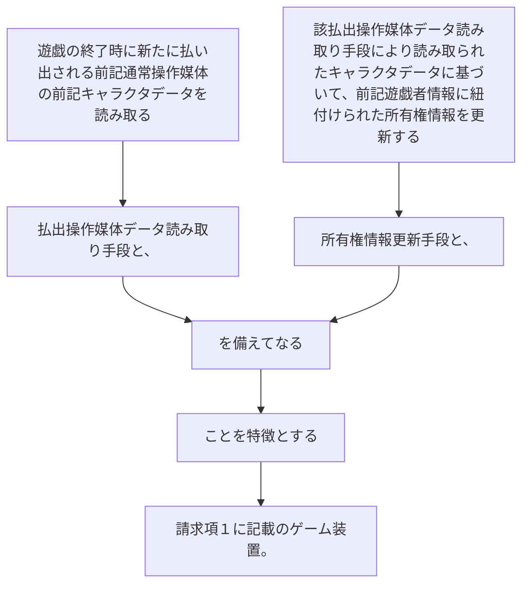

```mermaid
flowchart TD
A[遊戯の終了時に新たに払い出される前記通常操作媒体の前記キャラクタデータを読み取る]
B[払出操作媒体データ読み取り手段と、]
C[該払出操作媒体データ読み取り手段により読み取られたキャラクタデータに基づいて、前記遊戯者情報に紐付けられた所有権情報を更新する]
D[所有権情報更新手段と、]
E[を備えてなる]
F[ことを特徴とする]
G[請求項１に記載のゲーム装置。]

A --> B
C --> D
B --> E
D --> E
E --> F
F --> G
```