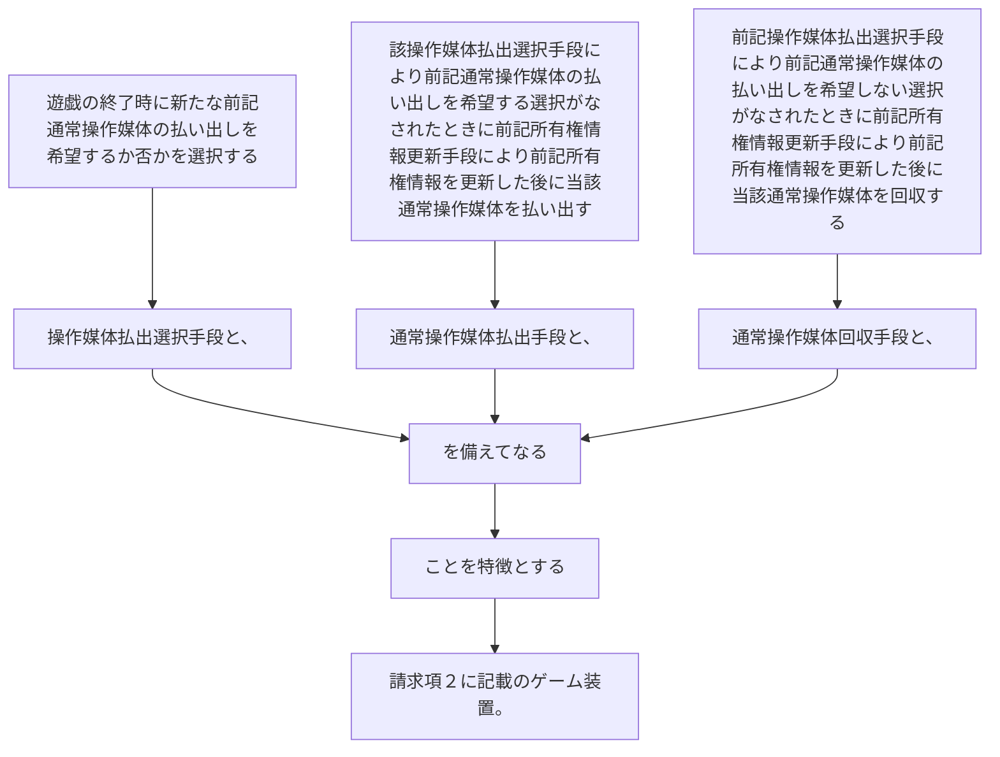

遊戯の終了時に新たな前記通常操作媒体の払い出しを希望するか否かを選択する操作媒体払出選択手段と、
該操作媒体払出選択手段により前記通常操作媒体の払い出しを希望する選択がなされたときに前記所有権情報更新手段により前記所有権情報を更新した後に当該通常操作媒体を払い出す通常操作媒体払出手段と、
前記操作媒体払出選択手段により前記通常操作媒体の払い出しを希望しない選択がなされたときに前記所有権情報更新手段により前記所有権情報を更新した後に当該通常操作媒体を回収する通常操作媒体回収手段と、
を備えてなることを特徴とする請求項２に記載のゲーム装置。
