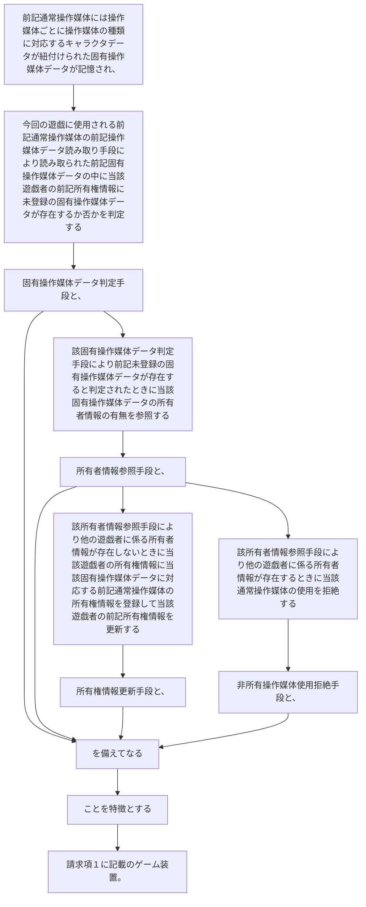

前記通常操作媒体には操作媒体ごとに操作媒体の種類に対応するキャラクタデータが紐付けられた固有操作媒体データが記憶され、
今回の遊戯に使用される前記通常操作媒体の前記操作媒体データ読み取り手段により読み取られた前記固有操作媒体データの中に当該遊戯者の前記所有権情報に未登録の固有操作媒体データが存在するか否かを判定する固有操作媒体データ判定手段と、
該固有操作媒体データ判定手段により前記未登録の固有操作媒体データが存在すると判定されたときに当該固有操作媒体データの所有者情報の有無を参照する所有者情報参照手段と、
該所有者情報参照手段により他の遊戯者に係る所有者情報が存在しないときに当該遊戯者の所有権情報に当該固有操作媒体データに対応する前記通常操作媒体の所有権情報を登録して当該遊戯者の前記所有権情報を更新する所有権情報更新手段と、
該所有者情報参照手段により他の遊戯者に係る所有者情報が存在するときに当該通常操作媒体の使用を拒絶する非所有操作媒体使用拒絶手段と、
を備えてなることを特徴とする請求項１に記載のゲーム装置。
