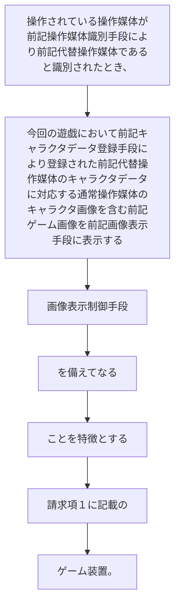

操作されている操作媒体が前記操作媒体識別手段により前記代替操作媒体であると識別されたとき、
今回の遊戯において前記キャラクタデータ登録手段により登録された前記代替操作媒体のキャラクタデータに対応する通常操作媒体のキャラクタ画像を含む前記ゲーム画像を前記画像表示手段に表示する画像表示制御手段を備えてなることを特徴とする請求項１に記載のゲーム装置。

```mermaid
flowchart TD
A[操作されている操作媒体が前記操作媒体識別手段により前記代替操作媒体であると識別されたとき、]
B[今回の遊戯において前記キャラクタデータ登録手段により登録された前記代替操作媒体のキャラクタデータに対応する通常操作媒体のキャラクタ画像を含む前記ゲーム画像を前記画像表示手段に表示する]
C[画像表示制御手段]
D[を備えてなる]
E[ことを特徴とする]
F[請求項１に記載の]
G[ゲーム装置。]
A --> B
B --> C
C --> D
D --> E
E --> F
F --> G
```