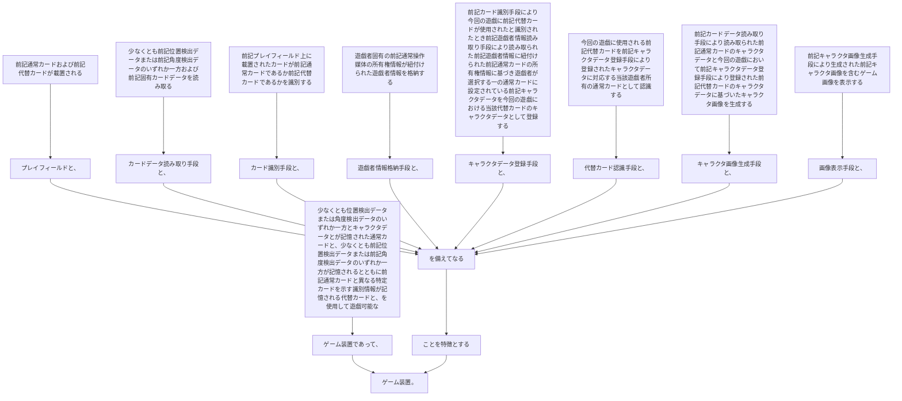

```mermaid
flowchart TD
A[少なくとも位置検出データまたは角度検出データのいずれか一方とキャラクタデータとが記憶された通常カードと、少なくとも前記位置検出データまたは前記角度検出データのいずれか一方が記憶されるとともに前記通常カードと異なる特定カードを示す識別情報が記憶される代替カードと、を使用して遊戯可能な]
B[ゲーム装置であって、]
C[前記通常カードおよび前記代替カードが載置される]
D[プレイフィールドと、]
E[少なくとも前記位置検出データまたは前記角度検出データのいずれか一方および前記固有カードデータを読み取る]
F[カードデータ読み取り手段と、]
G[前記プレイフィールド上に載置されたカードが前記通常カードであるか前記代替カードであるかを識別する]
H[カード識別手段と、]
I[遊戯者固有の前記通常操作媒体の所有権情報が紐付けられた遊戯者情報を格納する]
J[遊戯者情報格納手段と、]
K[前記カード識別手段により今回の遊戯に前記代替カードが使用されたと識別されたとき前記遊戯者情報読み取り手段により読み取られた前記遊戯者情報に紐付けられた前記通常カードの所有権情報に基づき遊戯者が選択する一の通常カードに設定されている前記キャラクタデータを今回の遊戯における当該代替カードのキャラクタデータとして登録する]
L[キャラクタデータ登録手段と、]
M[今回の遊戯に使用される前記代替カードを前記キャラクタデータ登録手段により登録されたキャラクタデータに対応する当該遊戯者所有の通常カードとして認識する]
N[代替カード認識手段と、]
O[前記カードデータ読み取り手段により読み取られた前記通常カードのキャラクタデータと今回の遊戯において前記キャラクタデータ登録手段により登録された前記代替カードのキャラクタデータに基づいたキャラクタ画像を生成する]
P[キャラクタ画像生成手段と、]
Q[前記キャラクタ画像生成手段により生成された前記キャラクタ画像を含むゲーム画像を表示する]
R[画像表示手段と、]
S[を備えてなる]
T[ことを特徴とする]
U[ゲーム装置。]

A --> B
B --> U

C --> D
E --> F
G --> H
I --> J
K --> L
M --> N
O --> P
Q --> R

D --> S
F --> S
H --> S
J --> S
L --> S
N --> S
P --> S
R --> S

S --> T
T --> U
```