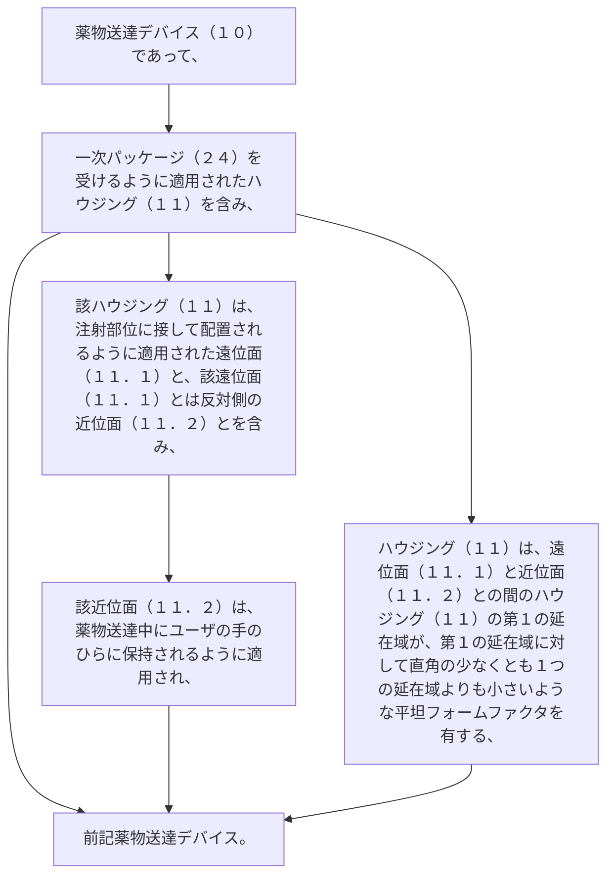

薬物送達デバイス（１０）であって、
一次パッケージ（２４）を受けるように適用されたハウジング（１１）を含み、
該ハウジング（１１）は、
注射部位に接して配置されるように適用された遠位面（１１．１）と、
該遠位面（１１．１）とは反対側の近位面（１１．２）とを含み、
該近位面（１１．２）は、薬物送達中にユーザの手のひらに保持されるように適用され、ハウジング（１１）は、遠位面（１１．１）と近位面（１１．２）との間のハウジング（１１）の第１の延在域が、第１の延在域に対して直角の少なくとも１つの延在域よりも小さいような平坦フォームファクタを有する、前記薬物送達デバイス。
