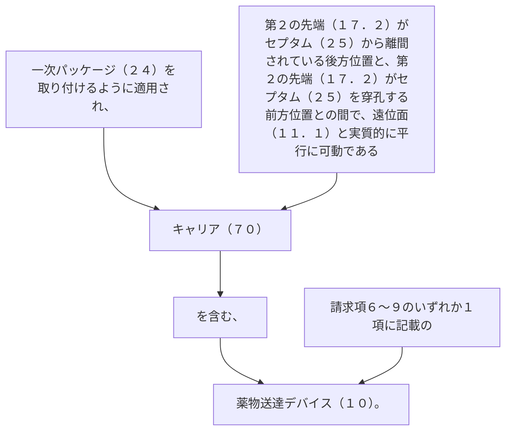

```mermaid
flowchart TD
A[一次パッケージ（２４）を取り付けるように適用され、]
B[第２の先端（１７．２）がセプタム（２５）から離間されている後方位置と、第２の先端（１７．２）がセプタム（２５）を穿孔する前方位置との間で、遠位面（１１．１）と実質的に平行に可動である]
C[キャリア（７０）]
D[を含む、]
E[請求項６～９のいずれか１項に記載の]
F[薬物送達デバイス（１０）。]
A --> C
B --> C
C --> D
D --> F
E --> F
```