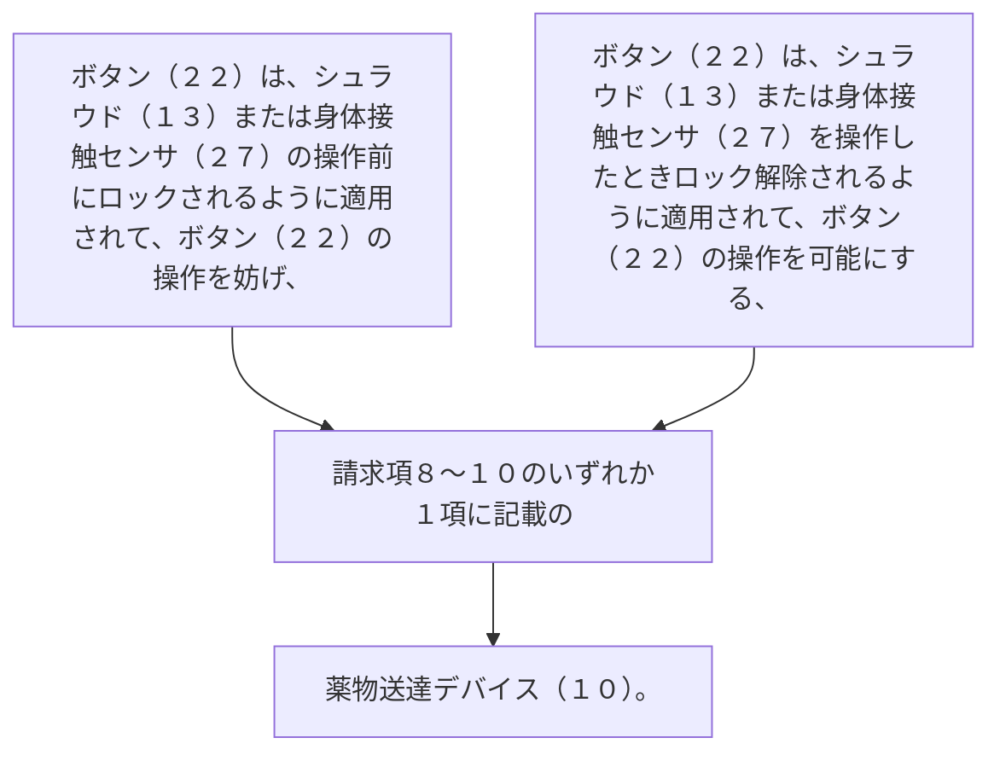

```mermaid
flowchart TD
A["ボタン（２２）は、シュラウド（１３）または身体接触センサ（２７）の操作前にロックされるように適用されて、ボタン（２２）の操作を妨げ、"]
B["ボタン（２２）は、シュラウド（１３）または身体接触センサ（２７）を操作したときロック解除されるように適用されて、ボタン（２２）の操作を可能にする、"]
C["請求項８～１０のいずれか１項に記載の"]
D["薬物送達デバイス（１０）。"]
A --> C
B --> C
C --> D
```