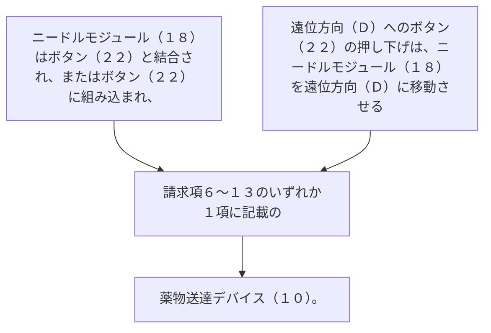

ニードルモジュール（１８）はボタン（２２）と結合され、またはボタン（２２）に組み込まれ、遠位方向（Ｄ）へのボタン（２２）の押し下げは、ニードルモジュール（１８）を遠位方向（Ｄ）に移動させる、請求項６～１３のいずれか１項に記載の薬物送達デバイス（１０）。

```mermaid
flowchart TD
A[ニードルモジュール（１８）はボタン（２２）と結合され、またはボタン（２２）に組み込まれ、]
B[遠位方向（Ｄ）へのボタン（２２）の押し下げは、ニードルモジュール（１８）を遠位方向（Ｄ）に移動させる]
C[請求項６～１３のいずれか１項に記載の]
D[薬物送達デバイス（１０）。]
A --> C
B --> C
C --> D
```