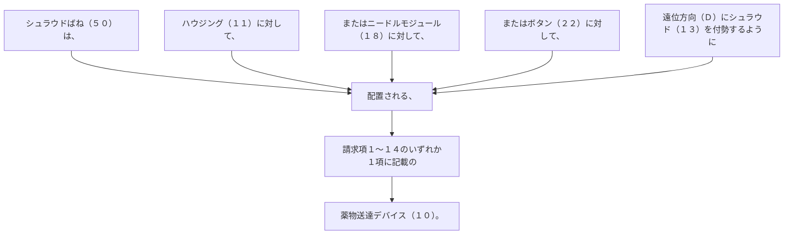

シュラウドばね（５０）は、ハウジング（１１）に対して、またはニードルモジュール（１８）に対して、またはボタン（２２）に対して、遠位方向（Ｄ）にシュラウド（１３）を付勢するように配置される、請求項１～１４のいずれか１項に記載の薬物送達デバイス（１０）。

```mermaid
flowchart TD
A[シュラウドばね（５０）は、]
B[ハウジング（１１）に対して、]
C[またはニードルモジュール（１８）に対して、]
D[またはボタン（２２）に対して、]
E[遠位方向（Ｄ）にシュラウド（１３）を付勢するように]
F[配置される、]
G[請求項１～１４のいずれか１項に記載の]
H[薬物送達デバイス（１０）。]
A --> F
B --> F
C --> F
D --> F
E --> F
F --> G
G --> H
```