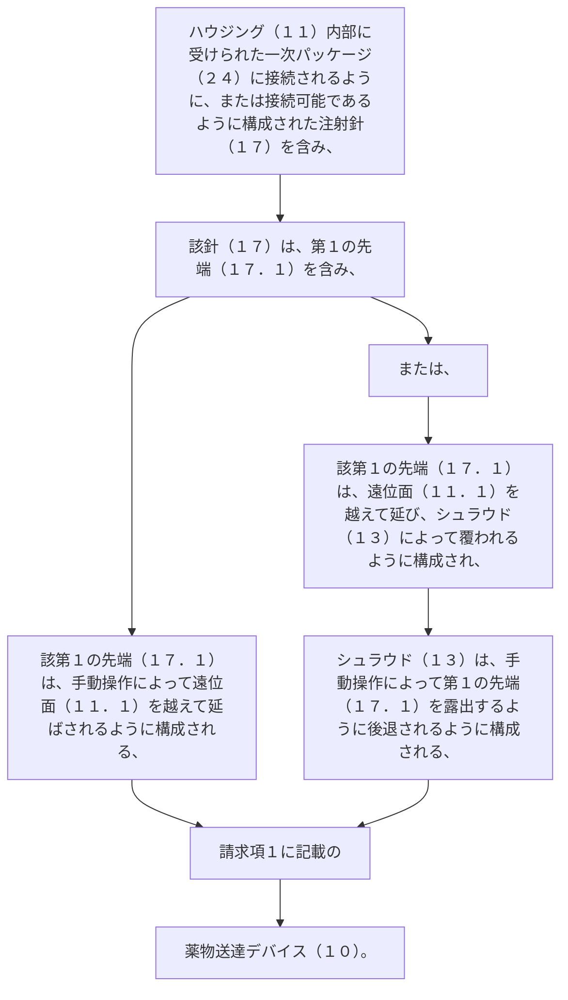

ハウジング（１１）内部に受けられた一次パッケージ（２４）に接続されるように、または接続可能であるように構成された注射針（１７）を含み、該針（１７）は、第１の先端（１７．１）を含み、該第１の先端（１７．１）は、
手動操作によって遠位面（１１．１）を越えて延ばされるように構成される、または
遠位面（１１．１）を越えて延び、シュラウド（１３）によって覆われるように構成され、シュラウド（１３）は、手動操作によって第１の先端（１７．１）を露出するように後退されるように構成される、
請求項１に記載の薬物送達デバイス（１０）。
