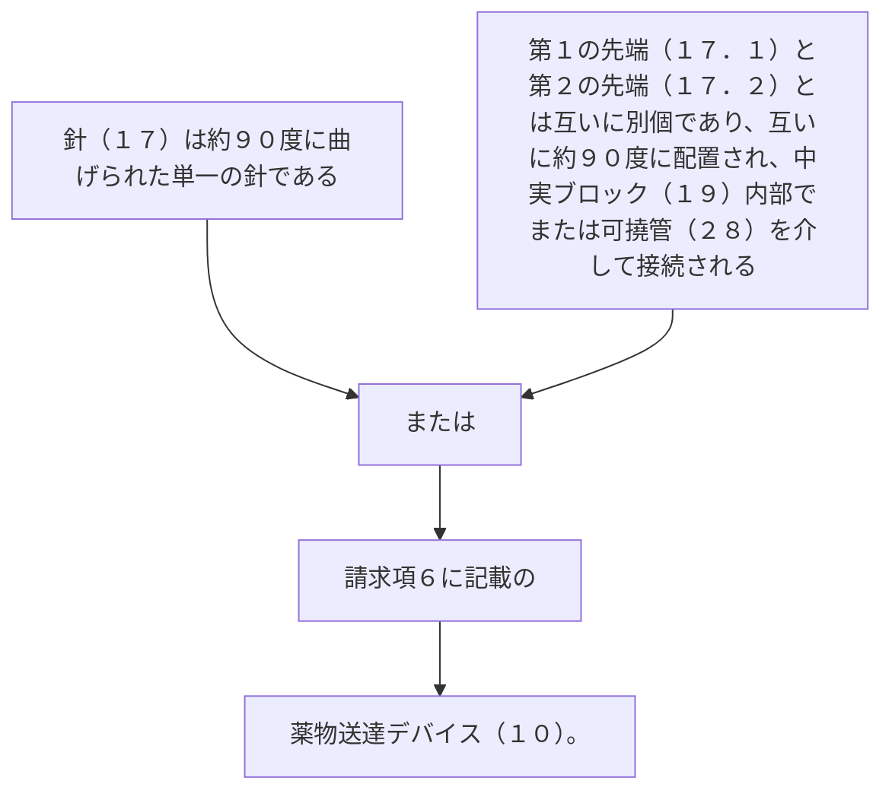

```mermaid
flowchart TD
A[針（１７）は約９０度に曲げられた単一の針である]
OR[または]
B[第１の先端（１７．１）と第２の先端（１７．２）とは互いに別個であり、互いに約９０度に配置され、中実ブロック（１９）内部でまたは可撓管（２８）を介して接続される]
C[請求項６に記載の]
D[薬物送達デバイス（１０）。]
A --> OR
B --> OR
OR --> C
C --> D
```