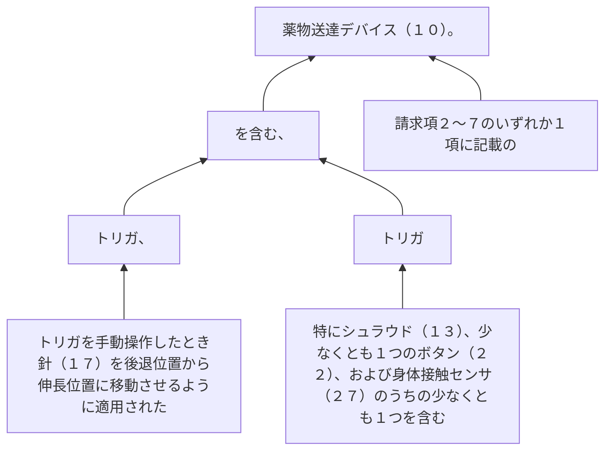

```mermaid
flowchart BT
A[トリガを手動操作したとき針（１７）を後退位置から伸長位置に移動させるように適用された]
B[トリガ、]
C[特にシュラウド（１３）、少なくとも１つのボタン（２２）、および身体接触センサ（２７）のうちの少なくとも１つを含む]
D[トリガ]
E[を含む、]
F[請求項２～７のいずれか１項に記載の]
G[薬物送達デバイス（１０）。]

A --> B
C --> D
B --> E
D --> E
E --> G
F --> G
```