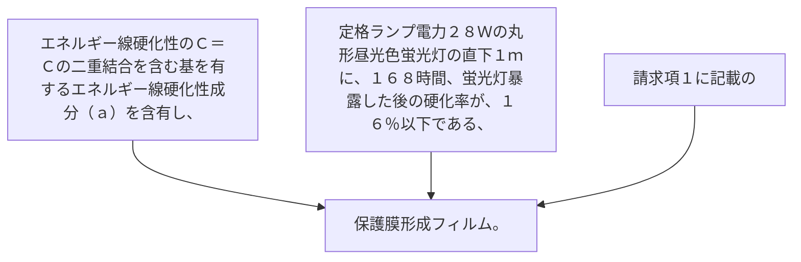

エネルギー線硬化性のＣ＝Ｃの二重結合を含む基を有するエネルギー線硬化性成分（ａ）を含有し、
定格ランプ電力２８Ｗの丸形昼光色蛍光灯の直下１ｍに、１６８時間、蛍光灯暴露した後の硬化率が、１６％以下である、請求項１に記載の保護膜形成フィルム。

```mermaid
flowchart TD
A[エネルギー線硬化性のＣ＝Ｃの二重結合を含む基を有するエネルギー線硬化性成分（ａ）を含有し、]
B[定格ランプ電力２８Ｗの丸形昼光色蛍光灯の直下１ｍに、１６８時間、蛍光灯暴露した後の硬化率が、１６％以下である、]
C[請求項１に記載の]
D[保護膜形成フィルム。]
A --> D
B --> D
C --> D
```