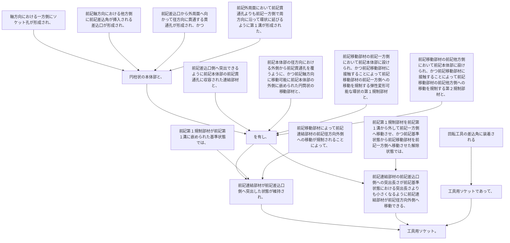

回転工具の差込角に装着される工具用ソケットであって、
軸方向における一方側にソケット孔が形成され、前記軸方向における他方側に前記差込角が挿入される差込口が形成され、前記差込口から外周面へ向かって径方向に貫通する貫通孔が形成され、かつ前記外周面において前記貫通孔よりも前記一方側で周方向に沿って環状に延びるように第１溝が形成された、円柱状の本体部と、
前記差込口側へ突出できるように前記本体部の前記貫通孔に収容された連結部材と、
前記本体部の径方向における外側から前記貫通孔を覆うように、かつ前記軸方向に移動可能に前記本体部の外側に嵌められた円筒状の移動部材と、
前記移動部材の前記一方側において前記本体部に設けられ、かつ前記移動部材に接触することによって前記移動部材の前記一方側への移動を規制する弾性変形可能な環状の第１規制部材と、
前記移動部材の前記他方側において前記本体部に設けられ、かつ前記移動部材に接触することによって前記移動部材の前記他方側への移動を規制する第２規制部材と、を有し、
前記第１規制部材が前記第１溝に嵌められた基準状態では、前記移動部材によって前記連結部材の前記径方向外側への移動が規制されることによって、前記連結部材が前記差込口側へ突出した状態が維持され、
前記第１規制部材を前記第１溝から外して前記一方側へ移動させ、かつ前記基準状態から前記移動部材を前記一方側へ移動させた解除状態では、前記連結部材の前記差込口側への突出長さが前記基準状態における突出長さよりも小さくなるように前記連結部材が前記径方向外側へ移動できる、工具用ソケット。
