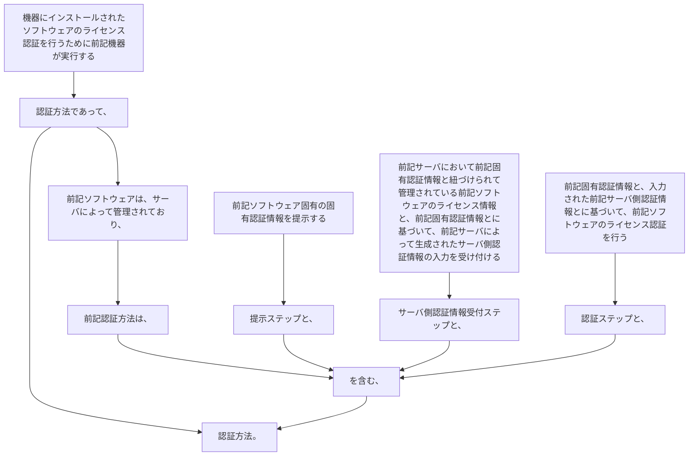

機器にインストールされたソフトウェアのライセンス認証を行うために前記機器が実行する認証方法であって、
前記ソフトウェアは、サーバによって管理されており、
前記認証方法は、
前記ソフトウェア固有の固有認証情報を提示する提示ステップと、
前記サーバにおいて前記固有認証情報と紐づけられて管理されている前記ソフトウェアのライセンス情報と、前記固有認証情報とに基づいて、前記サーバによって生成されたサーバ側認証情報の入力を受け付けるサーバ側認証情報受付ステップと、
前記固有認証情報と、入力された前記サーバ側認証情報とに基づいて、前記ソフトウェアのライセンス認証を行う認証ステップと、を含む、
認証方法。
