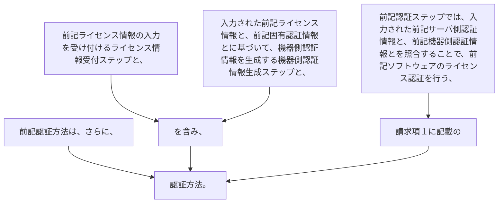

```mermaid
flowchart TD
A[前記認証方法は、さらに、]
B[前記ライセンス情報の入力を受け付けるライセンス情報受付ステップと、]
C[入力された前記ライセンス情報と、前記固有認証情報とに基づいて、機器側認証情報を生成する機器側認証情報生成ステップと、]
D[を含み、]
E[前記認証ステップでは、入力された前記サーバ側認証情報と、前記機器側認証情報とを照合することで、前記ソフトウェアのライセンス認証を行う、]
F[請求項１に記載の]
G[認証方法。]
A --> G
B --> D
C --> D
D --> G
E --> F
F --> G
```