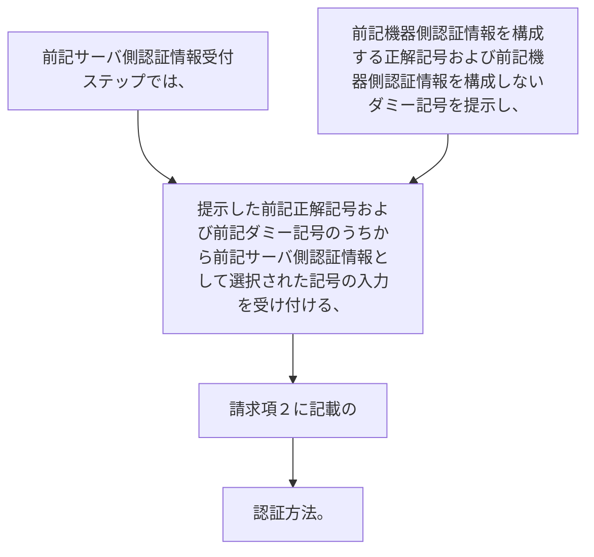

```mermaid
flowchart TD
A[前記サーバ側認証情報受付ステップでは、]
B[前記機器側認証情報を構成する正解記号および前記機器側認証情報を構成しないダミー記号を提示し、]
C[提示した前記正解記号および前記ダミー記号のうちから前記サーバ側認証情報として選択された記号の入力を受け付ける、]
D[請求項２に記載の]
E[認証方法。]
A --> C
B --> C
C --> D
D --> E
```