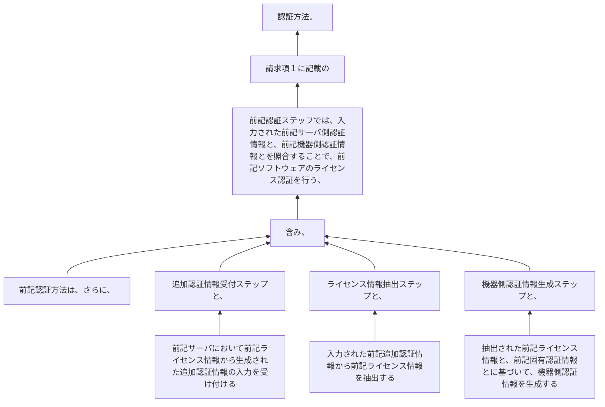

前記認証方法は、さらに、
前記サーバにおいて前記ライセンス情報から生成された追加認証情報の入力を受け付ける追加認証情報受付ステップと、
入力された前記追加認証情報から前記ライセンス情報を抽出するライセンス情報抽出ステップと、
抽出された前記ライセンス情報と、前記固有認証情報とに基づいて、機器側認証情報を生成する機器側認証情報生成ステップと、を含み、
前記認証ステップでは、入力された前記サーバ側認証情報と、前記機器側認証情報とを照合することで、前記ソフトウェアのライセンス認証を行う、
請求項１に記載の認証方法。
