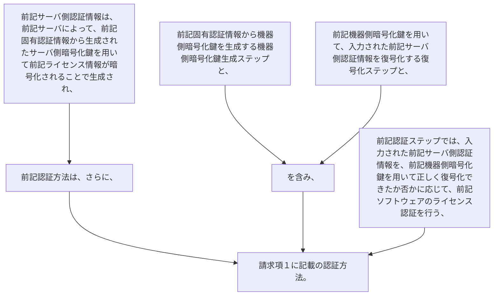

前記サーバ側認証情報は、前記サーバによって、前記固有認証情報から生成されたサーバ側暗号化鍵を用いて前記ライセンス情報が暗号化されることで生成され、
前記認証方法は、さらに、
前記固有認証情報から機器側暗号化鍵を生成する機器側暗号化鍵生成ステップと、
前記機器側暗号化鍵を用いて、入力された前記サーバ側認証情報を復号化する復号化ステップと、を含み、
前記認証ステップでは、入力された前記サーバ側認証情報を、前記機器側暗号化鍵を用いて正しく復号化できたか否かに応じて、前記ソフトウェアのライセンス認証を行う、
請求項１に記載の認証方法。
