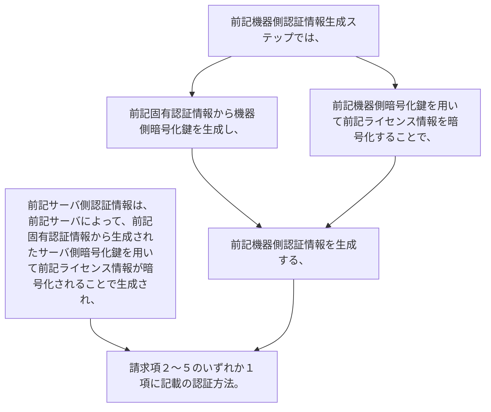

前記サーバ側認証情報は、前記サーバによって、前記固有認証情報から生成されたサーバ側暗号化鍵を用いて前記ライセンス情報が暗号化されることで生成され、
前記機器側認証情報生成ステップでは、前記固有認証情報から機器側暗号化鍵を生成し、前記機器側暗号化鍵を用いて前記ライセンス情報を暗号化することで、前記機器側認証情報を生成する、
請求項２～５のいずれか１項に記載の認証方法。

```mermaid
flowchart TD
A[前記サーバ側認証情報は、前記サーバによって、前記固有認証情報から生成されたサーバ側暗号化鍵を用いて前記ライセンス情報が暗号化されることで生成され、]
B[前記機器側認証情報生成ステップでは、]
C[前記固有認証情報から機器側暗号化鍵を生成し、]
D[前記機器側暗号化鍵を用いて前記ライセンス情報を暗号化することで、]
E[前記機器側認証情報を生成する、]
F[請求項２～５のいずれか１項に記載の認証方法。]

A --> F
B --> C
B --> D
C --> E
D --> E
E --> F
```