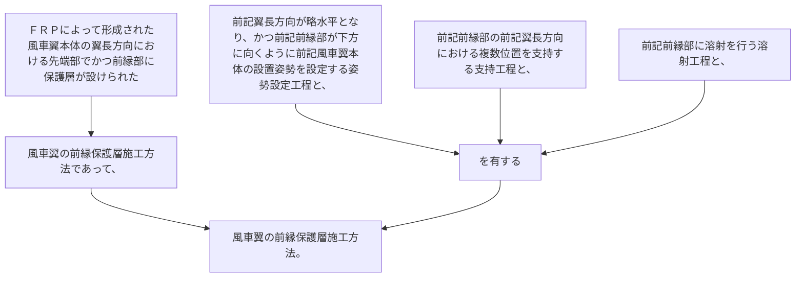

```mermaid
flowchart TD
A[ＦＲＰによって形成された風車翼本体の翼長方向における先端部でかつ前縁部に保護層が設けられた]
B[風車翼の前縁保護層施工方法であって、]
C[前記翼長方向が略水平となり、かつ前記前縁部が下方に向くように前記風車翼本体の設置姿勢を設定する姿勢設定工程と、]
D[前記前縁部の前記翼長方向における複数位置を支持する支持工程と、]
E[前記前縁部に溶射を行う溶射工程と、]
F[を有する]
G[風車翼の前縁保護層施工方法。]
A --> B
B --> G
C --> F
D --> F
E --> F
F --> G
```