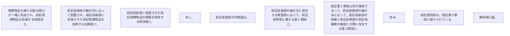

喫煙物品を挿入可能な開口が一端に形成され、前記喫煙物品を収容する収容部と、
前記収容部の軸方向に沿って配置され、前記収容部に収容された前記喫煙物品を加熱する加熱部と、
前記収容部に収容された前記喫煙物品の側面を把持する把持部と、
を有し、
前記収容部の内側面は、
前記収容部の軸方向と直交する断面視において、前記加熱部と重なる第１領域と、
前記第１領域以外の領域であって、前記収容部の軸方向に沿って、前記収容部の他端と前記加熱部の前記他端側の端部との間に存在する第２領域と、
を含み、
前記把持部は、前記第２領域に設けられている、
香味吸引器。
