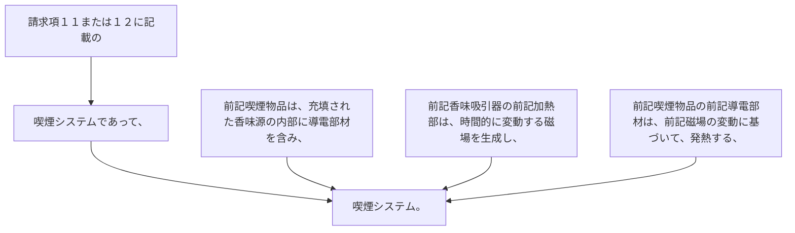

```mermaid
flowchart TD
A[請求項１１または１２に記載の]
B[喫煙システムであって、]
C[前記喫煙物品は、充填された香味源の内部に導電部材を含み、]
D[前記香味吸引器の前記加熱部は、時間的に変動する磁場を生成し、]
E[前記喫煙物品の前記導電部材は、前記磁場の変動に基づいて、発熱する、]
F[喫煙システム。]
A --> B
B --> F
C --> F
D --> F
E --> F
```