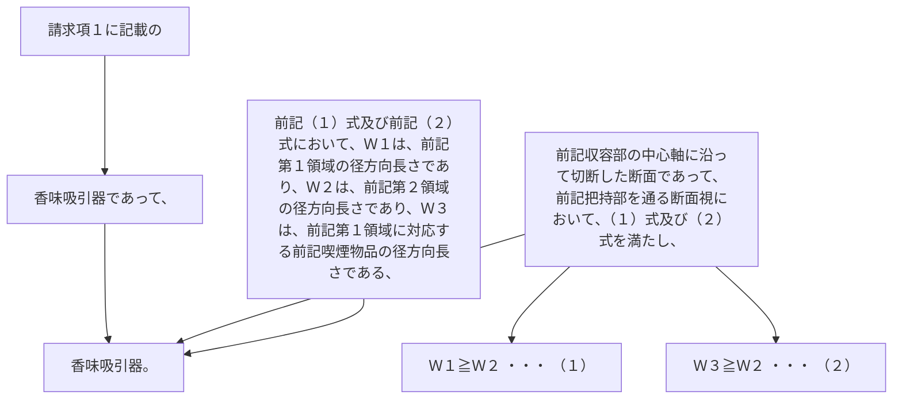

```mermaid
flowchart TD
A[請求項１に記載の]
B[香味吸引器であって、]
C[前記収容部の中心軸に沿って切断した断面であって、前記把持部を通る断面視において、（１）式及び（２）式を満たし、]
D[Ｗ１≧Ｗ２  ・・・  （１）]
E[Ｗ３≧Ｗ２  ・・・  （２）]
F[前記（１）式及び前記（２）式において、Ｗ１は、前記第１領域の径方向長さであり、Ｗ２は、前記第２領域の径方向長さであり、Ｗ３は、前記第１領域に対応する前記喫煙物品の径方向長さである、]
G[香味吸引器。]

A --> B
B --> G
C --> G
F --> G
C --> D
C --> E
```