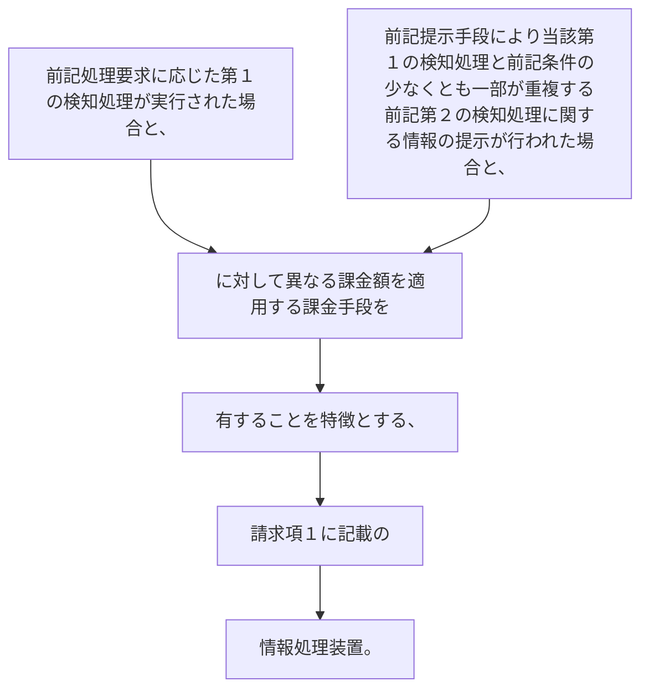

```mermaid
flowchart TD
A[前記処理要求に応じた第１の検知処理が実行された場合と、]
B[前記提示手段により当該第１の検知処理と前記条件の少なくとも一部が重複する前記第２の検知処理に関する情報の提示が行われた場合と、]
C[に対して異なる課金額を適用する課金手段を]
D[有することを特徴とする、]
E[請求項１に記載の]
F[情報処理装置。]

A --> C
B --> C
C --> D
D --> E
E --> F
```