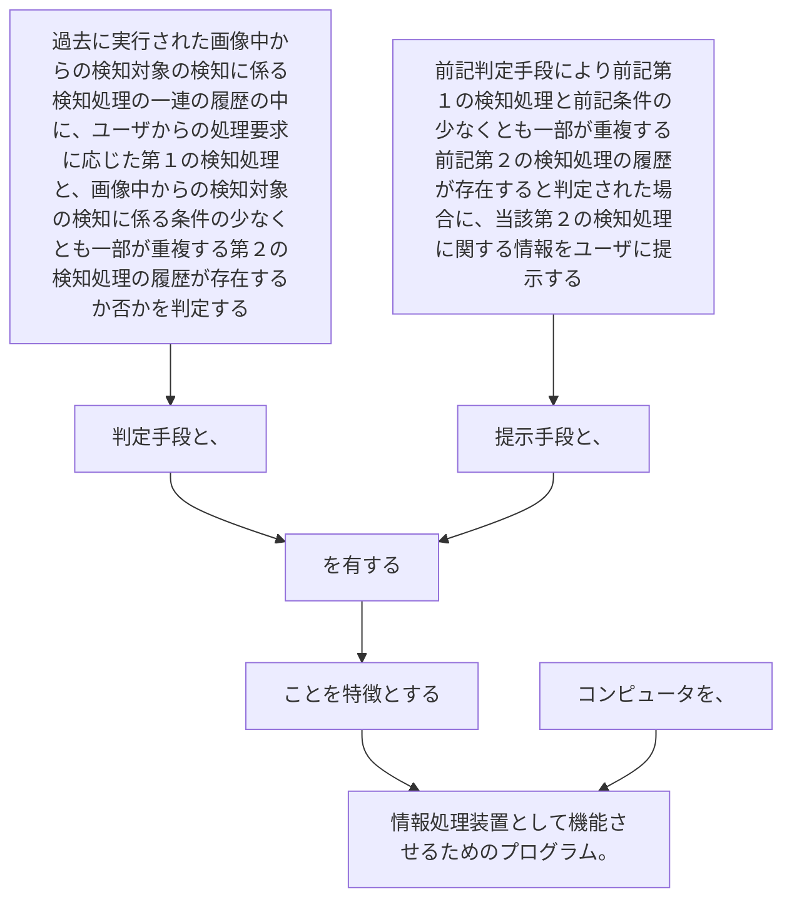

```mermaid
flowchart TD
A[コンピュータを、]
B[過去に実行された画像中からの検知対象の検知に係る検知処理の一連の履歴の中に、ユーザからの処理要求に応じた第１の検知処理と、画像中からの検知対象の検知に係る条件の少なくとも一部が重複する第２の検知処理の履歴が存在するか否かを判定する]
C[判定手段と、]
D[前記判定手段により前記第１の検知処理と前記条件の少なくとも一部が重複する前記第２の検知処理の履歴が存在すると判定された場合に、当該第２の検知処理に関する情報をユーザに提示する]
E[提示手段と、]
F[を有する]
G[ことを特徴とする]
H[情報処理装置として機能させるためのプログラム。]

B --> C
D --> E
C --> F
E --> F
F --> G
G --> H
A --> H
```