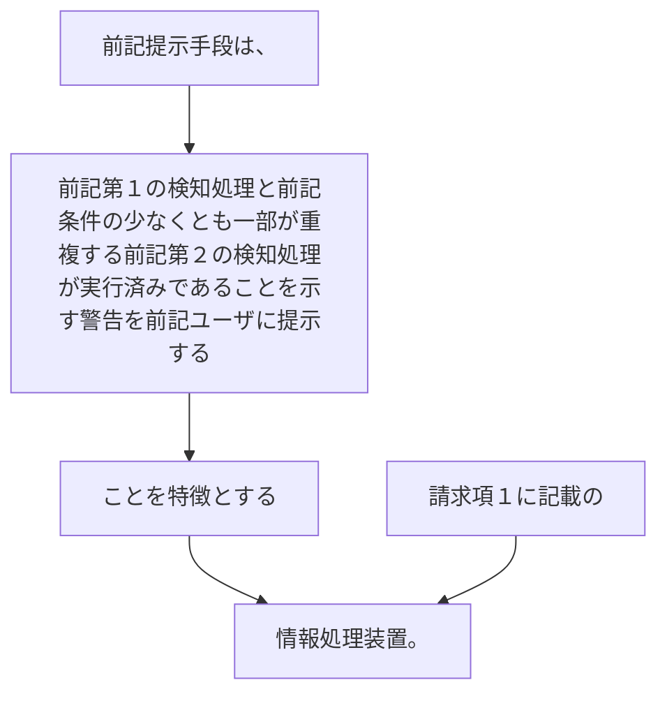

前記提示手段は、前記第１の検知処理と前記条件の少なくとも一部が重複する前記第２の検知処理が実行済みであることを示す警告を前記ユーザに提示することを特徴とする、請求項１に記載の情報処理装置。

```mermaid
flowchart TD
A[前記提示手段は、]
B[前記第１の検知処理と前記条件の少なくとも一部が重複する前記第２の検知処理が実行済みであることを示す警告を前記ユーザに提示する]
C[ことを特徴とする]
D[請求項１に記載の]
E[情報処理装置。]
A --> B
B --> C
C --> E
D --> E
```