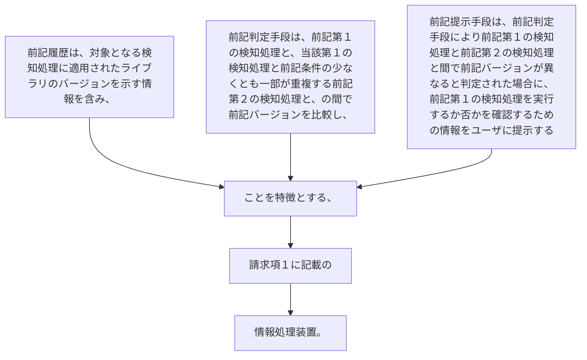

前記履歴は、対象となる検知処理に適用されたライブラリのバージョンを示す情報を含み、
前記判定手段は、前記第１の検知処理と、当該第１の検知処理と前記条件の少なくとも一部が重複する前記第２の検知処理と、の間で前記バージョンを比較し、
前記提示手段は、前記判定手段により前記第１の検知処理と前記第２の検知処理と間で前記バージョンが異なると判定された場合に、前記第１の検知処理を実行するか否かを確認するための情報をユーザに提示する
ことを特徴とする、請求項１に記載の情報処理装置。
