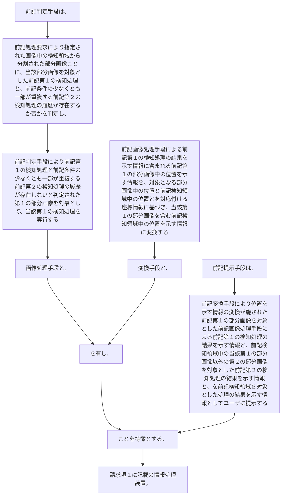

前記判定手段は、前記処理要求により指定された画像中の検知領域から分割された部分画像ごとに、当該部分画像を対象とした前記第１の検知処理と、前記条件の少なくとも一部が重複する前記第２の検知処理の履歴が存在するか否かを判定し、
前記判定手段により前記第１の検知処理と前記条件の少なくとも一部が重複する前記第２の検知処理の履歴が存在しないと判定された第１の部分画像を対象として、当該第１の検知処理を実行する画像処理手段と、
前記画像処理手段による前記第１の検知処理の結果を示す情報に含まれる前記第１の部分画像中の位置を示す情報を、対象となる部分画像中の位置と前記検知領域中の位置とを対応付ける座標情報に基づき、当該第１の部分画像を含む前記検知領域中の位置を示す情報に変換する変換手段と、
を有し、
前記提示手段は、前記変換手段により位置を示す情報の変換が施された前記第１の部分画像を対象とした前記画像処理手段による前記第１の検知処理の結果を示す情報と、前記検知領域中の当該第１の部分画像以外の第２の部分画像を対象とした前記第２の検知処理の結果を示す情報と、を前記検知領域を対象とした処理の結果を示す情報としてユーザに提示する
ことを特徴とする、請求項１に記載の情報処理装置。
