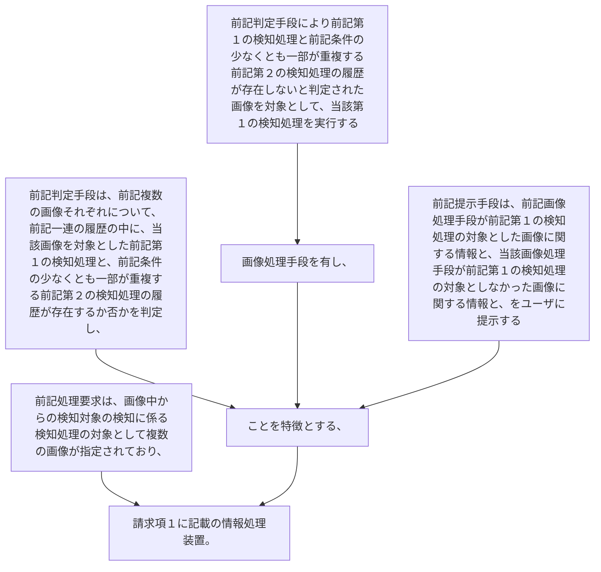

```mermaid
flowchart TD
A[前記処理要求は、画像中からの検知対象の検知に係る検知処理の対象として複数の画像が指定されており、]
B[前記判定手段は、前記複数の画像それぞれについて、前記一連の履歴の中に、当該画像を対象とした前記第１の検知処理と、前記条件の少なくとも一部が重複する前記第２の検知処理の履歴が存在するか否かを判定し、]
C[前記判定手段により前記第１の検知処理と前記条件の少なくとも一部が重複する前記第２の検知処理の履歴が存在しないと判定された画像を対象として、当該第１の検知処理を実行する]
D[画像処理手段を有し、]
E[前記提示手段は、前記画像処理手段が前記第１の検知処理の対象とした画像に関する情報と、当該画像処理手段が前記第１の検知処理の対象としなかった画像に関する情報と、をユーザに提示する]
F[ことを特徴とする、]
G[請求項１に記載の情報処理装置。]
A --> G
B --> F
C --> D
D --> F
E --> F
F --> G
```