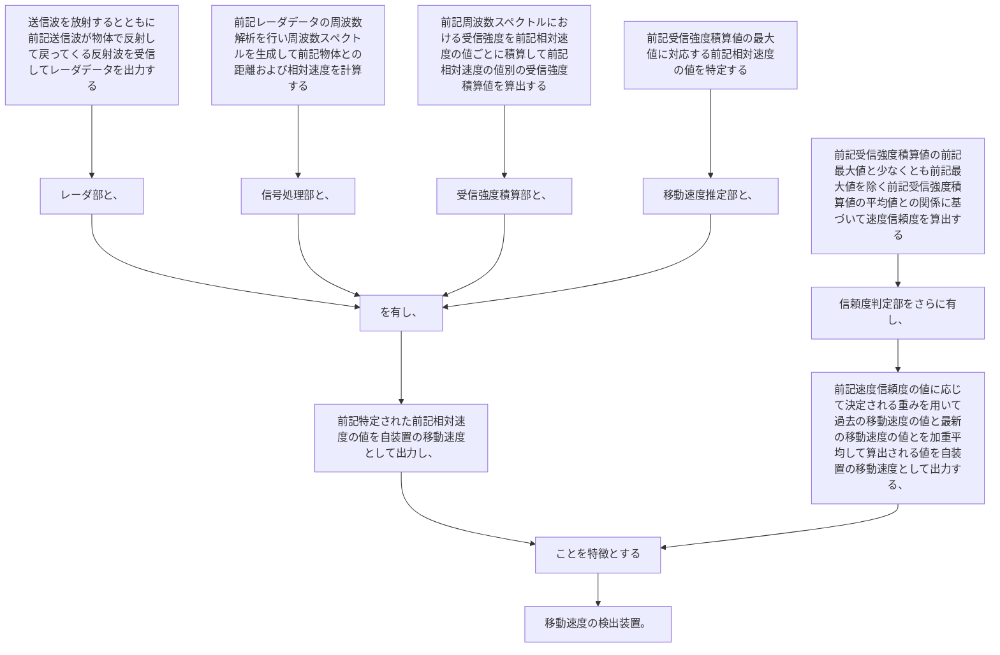

送信波を放射するとともに前記送信波が物体で反射して戻ってくる反射波を受信してレーダデータを出力するレーダ部と、
前記レーダデータの周波数解析を行い周波数スペクトルを生成して前記物体との距離および相対速度を計算する信号処理部と、
前記周波数スペクトルにおける受信強度を前記相対速度の値ごとに積算して前記相対速度の値別の受信強度積算値を算出する受信強度積算部と、
前記受信強度積算値の最大値に対応する前記相対速度の値を特定する移動速度推定部と、を有し、
前記特定された前記相対速度の値を自装置の移動速度として出力し、
前記受信強度積算値の前記最大値と少なくとも前記最大値を除く前記受信強度積算値の平均値との関係に基づいて速度信頼度を算出する信頼度判定部をさらに有し、
前記速度信頼度の値に応じて決定される重みを用いて過去の移動速度の値と最新の移動速度の値とを加重平均して算出される値を自装置の移動速度として出力する、
ことを特徴とする移動速度の検出装置。
