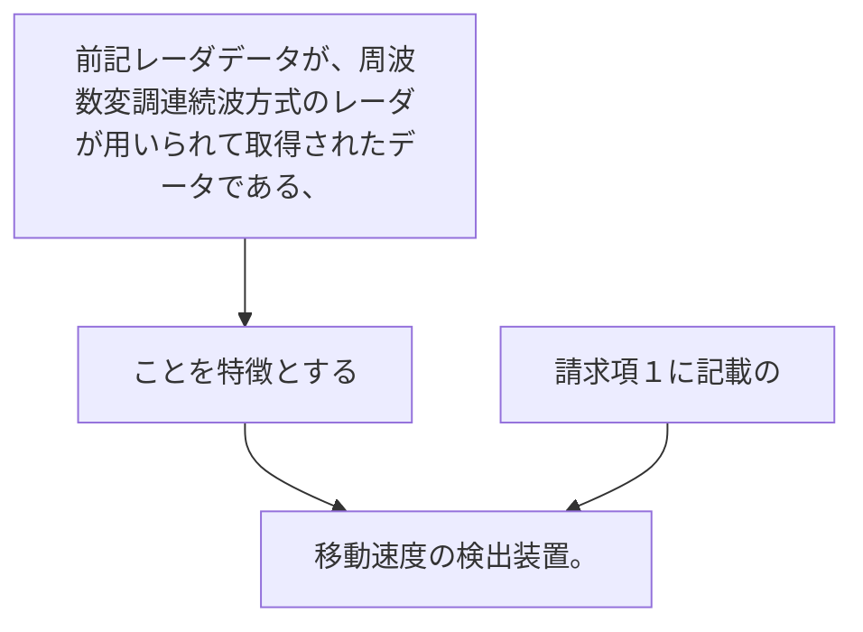

前記レーダデータが、周波数変調連続波方式のレーダが用いられて取得されたデータである、
ことを特徴とする請求項１に記載の移動速度の検出装置。

```mermaid
flowchart TD
A[前記レーダデータが、周波数変調連続波方式のレーダが用いられて取得されたデータである、]
B[ことを特徴とする]
C[請求項１に記載の]
D[移動速度の検出装置。]
A --> B
B --> D
C --> D
```