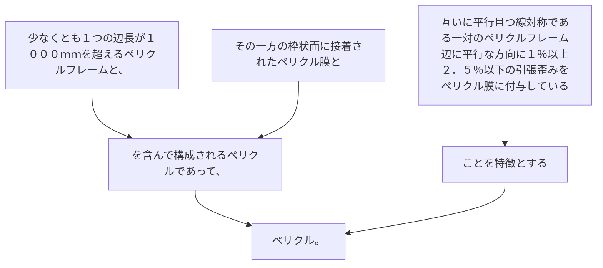

```mermaid
flowchart TD
A[少なくとも１つの辺長が１０００ｍｍを超えるペリクルフレームと、]
B[その一方の枠状面に接着されたペリクル膜と]
C[を含んで構成されるペリクルであって、]
D[互いに平行且つ線対称である一対のペリクルフレーム辺に平行な方向に１％以上２．５％以下の引張歪みをペリクル膜に付与している]
E[ことを特徴とする]
F[ペリクル。]
A --> C
B --> C
C --> F
D --> E
E --> F
```