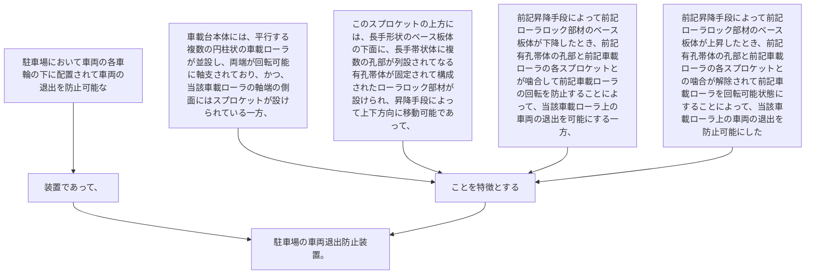

```mermaid
flowchart TD
A[駐車場において車両の各車輪の下に配置されて車両の退出を防止可能な] 
B[装置であって、]
C[車載台本体には、平行する複数の円柱状の車載ローラが並設し、両端が回転可能に軸支されており、かつ、当該車載ローラの軸端の側面にはスプロケットが設けられている一方、]
D[このスプロケットの上方には、長手形状のベース板体の下面に、長手帯状体に複数の孔部が列設されてなる有孔帯体が固定されて構成されたローラロック部材が設けられ、昇降手段によって上下方向に移動可能であって、]
E[前記昇降手段によって前記ローラロック部材のベース板体が下降したとき、前記有孔帯体の孔部と前記車載ローラの各スプロケットとが噛合して前記車載ローラの回転を防止することによって、当該車載ローラ上の車両の退出を可能にする一方、]
F[前記昇降手段によって前記ローラロック部材のベース板体が上昇したとき、前記有孔帯体の孔部と前記車載ローラの各スプロケットとの噛合が解除されて前記車載ローラを回転可能状態にすることによって、当該車載ローラ上の車両の退出を防止可能にした]
G[ことを特徴とする]
H[駐車場の車両退出防止装置。]
A --> B
B --> H
C --> G
D --> G
E --> G
F --> G
G --> H
```