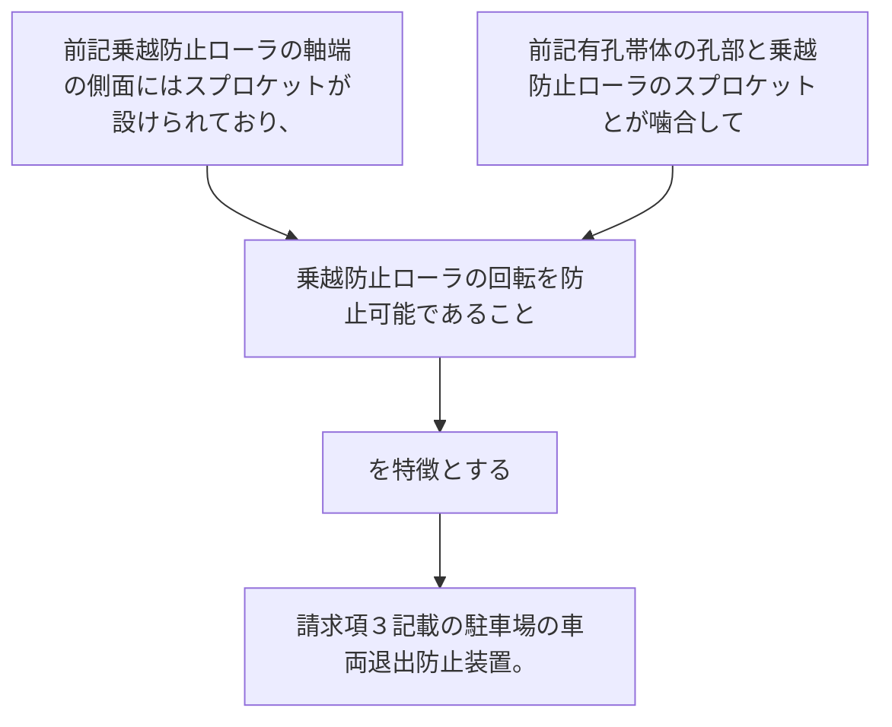

前記乗越防止ローラの軸端の側面にはスプロケットが設けられており、
前記有孔帯体の孔部と乗越防止ローラのスプロケットとが噛合して乗越防止ローラの回転を防止可能であることを特徴とする請求項３記載の駐車場の車両退出防止装置。

```mermaid
flowchart TD
A[前記乗越防止ローラの軸端の側面にはスプロケットが設けられており、]
B[前記有孔帯体の孔部と乗越防止ローラのスプロケットとが噛合して]
C[乗越防止ローラの回転を防止可能であること]
D[を特徴とする]
E[請求項３記載の駐車場の車両退出防止装置。]
A --> C
B --> C
C --> D
D --> E
```