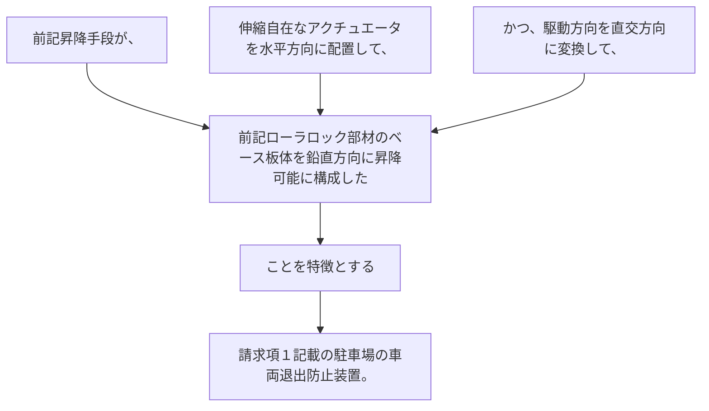

前記昇降手段が、伸縮自在なアクチュエータを水平方向に配置して、かつ、駆動方向を直交方向に変換して、前記ローラロック部材のベース板体を鉛直方向に昇降可能に構成したことを特徴とする請求項１記載の駐車場の車両退出防止装置。

```mermaid
flowchart TD
A[前記昇降手段が、]
B[伸縮自在なアクチュエータを水平方向に配置して、]
C[かつ、駆動方向を直交方向に変換して、]
D[前記ローラロック部材のベース板体を鉛直方向に昇降可能に構成した]
E[ことを特徴とする]
F[請求項１記載の駐車場の車両退出防止装置。]
A --> D
B --> D
C --> D
D --> E
E --> F
```