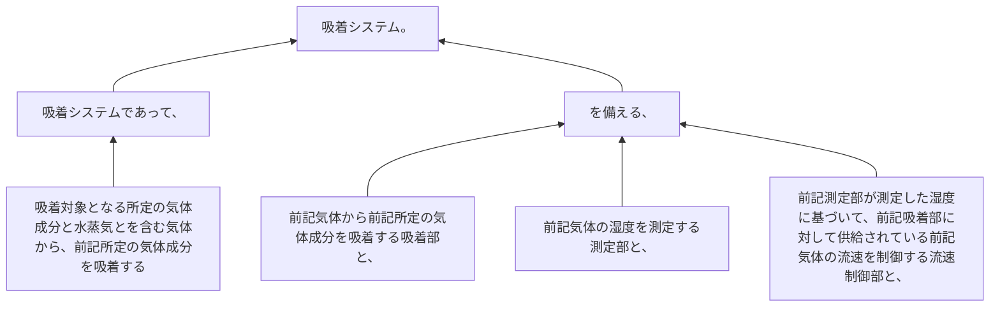

```mermaid
flowchart BT
A[吸着対象となる所定の気体成分と水蒸気とを含む気体から、前記所定の気体成分を吸着する]
B[吸着システムであって、]
C[前記気体から前記所定の気体成分を吸着する吸着部と、]
D[前記気体の湿度を測定する測定部と、]
E[前記測定部が測定した湿度に基づいて、前記吸着部に対して供給されている前記気体の流速を制御する流速制御部と、]
F[を備える、]
G[吸着システム。]
A --> B
B --> G
C --> F
D --> F
E --> F
F --> G
```