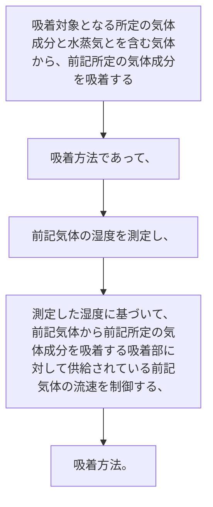

```mermaid
flowchart TD
A[吸着対象となる所定の気体成分と水蒸気とを含む気体から、前記所定の気体成分を吸着する]
B[吸着方法であって、]
C[前記気体の湿度を測定し、]
D[測定した湿度に基づいて、前記気体から前記所定の気体成分を吸着する吸着部に対して供給されている前記気体の流速を制御する、]
E[吸着方法。]
A --> B
B --> C
C --> D
D --> E
```