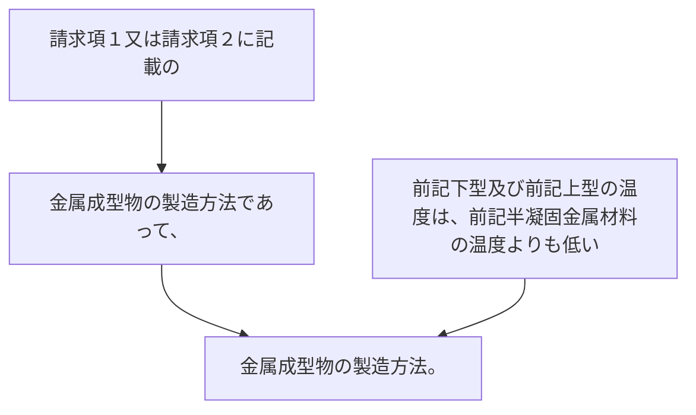

請求項１又は請求項２に記載の金属成型物の製造方法であって、
前記下型及び前記上型の温度は、前記半凝固金属材料の温度よりも低い
金属成型物の製造方法。

```mermaid
flowchart TD
A[請求項１又は請求項２に記載の]
B[金属成型物の製造方法であって、]
C[前記下型及び前記上型の温度は、前記半凝固金属材料の温度よりも低い]
D[金属成型物の製造方法。]
A --> B
B --> D
C --> D
```