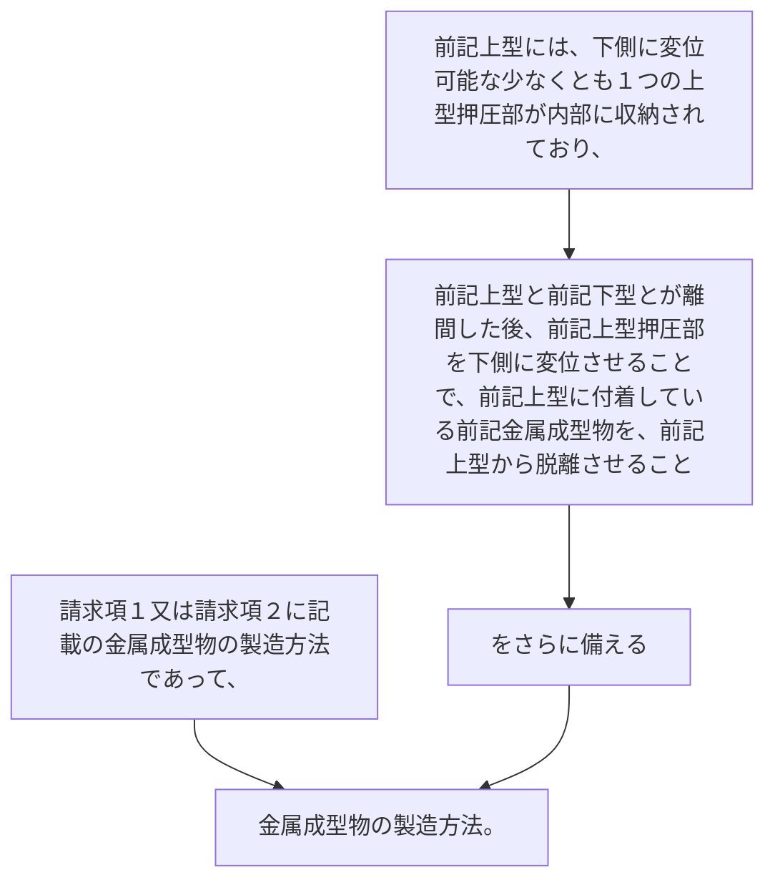

請求項１又は請求項２に記載の金属成型物の製造方法であって、
前記上型には、下側に変位可能な少なくとも１つの上型押圧部が内部に収納されており、
前記上型と前記下型とが離間した後、前記上型押圧部を下側に変位させることで、前記上型に付着している前記金属成型物を、前記上型から脱離させること
をさらに備える金属成型物の製造方法。

```mermaid
flowchart TD
A[請求項１又は請求項２に記載の金属成型物の製造方法であって、]
B[前記上型には、下側に変位可能な少なくとも１つの上型押圧部が内部に収納されており、]
C[前記上型と前記下型とが離間した後、前記上型押圧部を下側に変位させることで、前記上型に付着している前記金属成型物を、前記上型から脱離させること]
D[をさらに備える]
E[金属成型物の製造方法。]
A --> E
B --> C
C --> D
D --> E
```