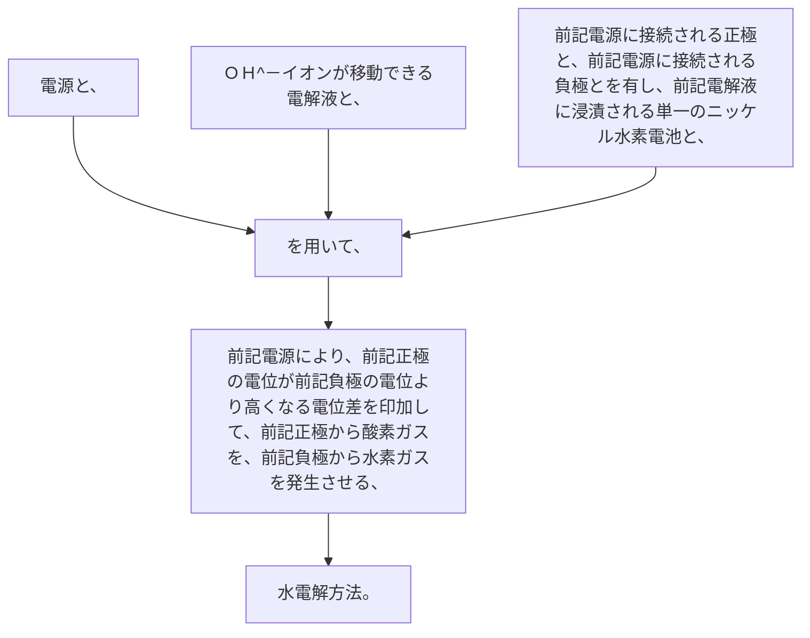

```mermaid
flowchart TD
A[電源と、]
B[ＯＨ^－イオンが移動できる電解液と、]
C[前記電源に接続される正極と、前記電源に接続される負極とを有し、前記電解液に浸漬される単一のニッケル水素電池と、]
D[を用いて、]
E[前記電源により、前記正極の電位が前記負極の電位より高くなる電位差を印加して、前記正極から酸素ガスを、前記負極から水素ガスを発生させる、]
F[水電解方法。]
A --> D
B --> D
C --> D
D --> E
E --> F
```