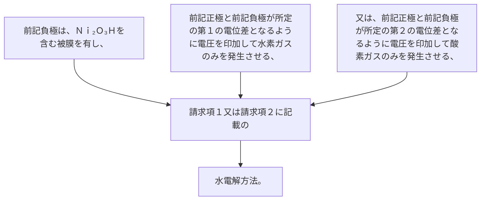

前記負極は、Ｎｉ
２
Ｏ
３
Ｈを含む被膜を有し、
前記正極と前記負極が所定の第１の電位差となるように電圧を印加して水素ガスのみを発生させる、又は、前記正極と前記負極が所定の第２の電位差となるように電圧を印加して酸素ガスのみを発生させる、
請求項１又は請求項２に記載の水電解方法。

```mermaid
flowchart TD
A[前記負極は、Ｎｉ₂Ｏ₃Ｈを含む被膜を有し、]
B[前記正極と前記負極が所定の第１の電位差となるように電圧を印加して水素ガスのみを発生させる、]
C[又は、前記正極と前記負極が所定の第２の電位差となるように電圧を印加して酸素ガスのみを発生させる、]
D[請求項１又は請求項２に記載の]
E[水電解方法。]
A --> D
B --> D
C --> D
D --> E
```