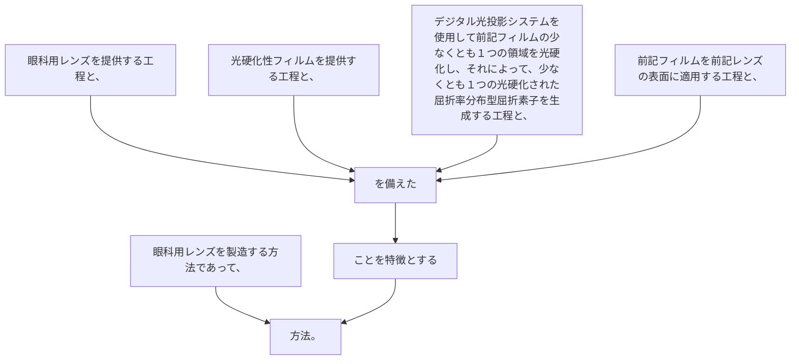

```mermaid
flowchart TD
A[眼科用レンズを製造する方法であって、]
B[眼科用レンズを提供する工程と、]
C[光硬化性フィルムを提供する工程と、]
D[デジタル光投影システムを使用して前記フィルムの少なくとも１つの領域を光硬化し、それによって、少なくとも１つの光硬化された屈折率分布型屈折素子を生成する工程と、]
E[前記フィルムを前記レンズの表面に適用する工程と、]
F[を備えた]
G[ことを特徴とする]
H[方法。]
A --> H
B --> F
C --> F
D --> F
E --> F
F --> G
G --> H
```